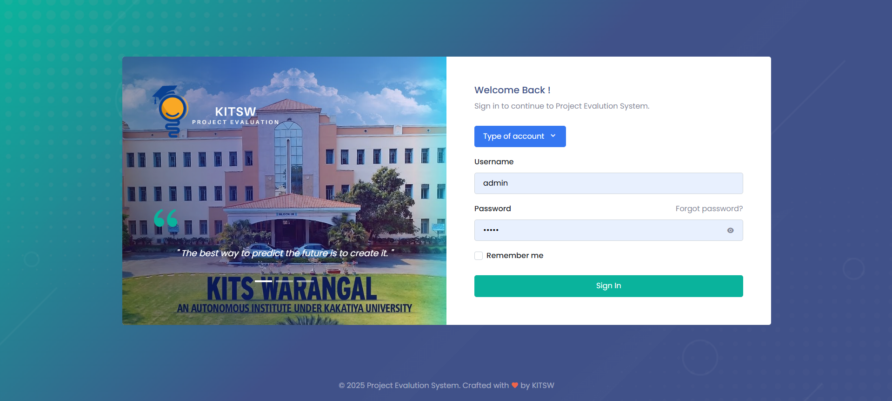
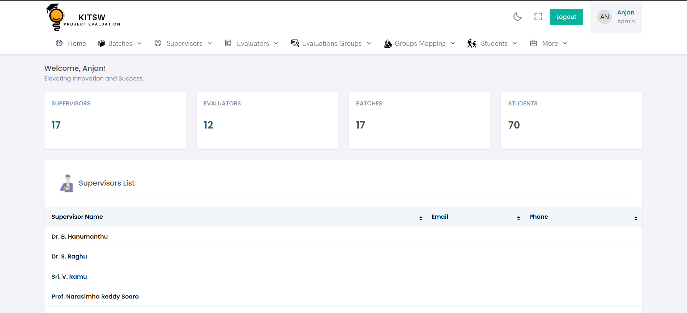
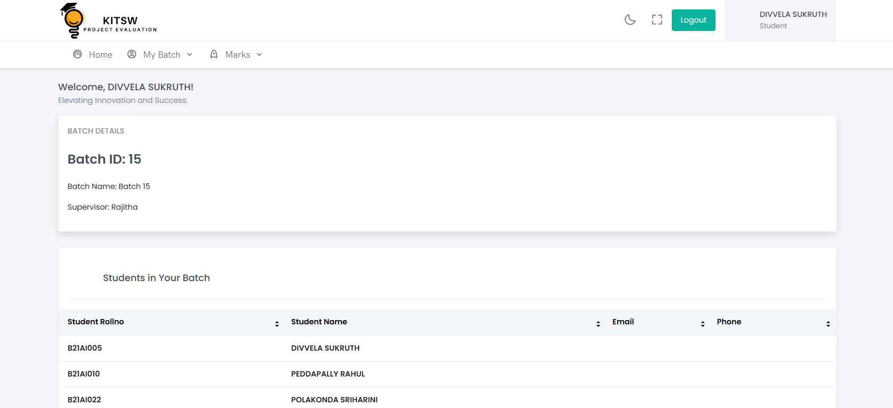
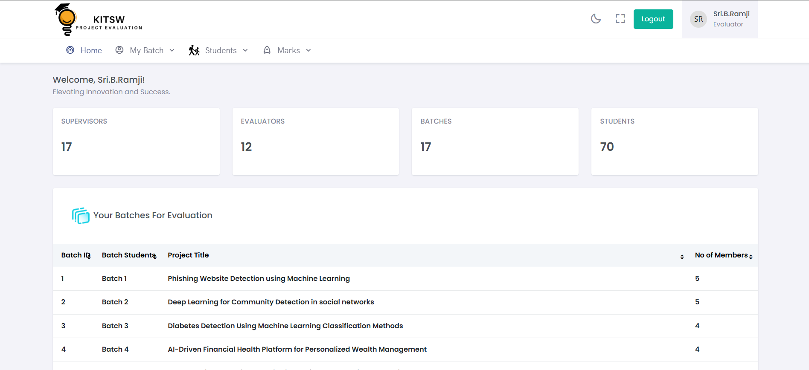
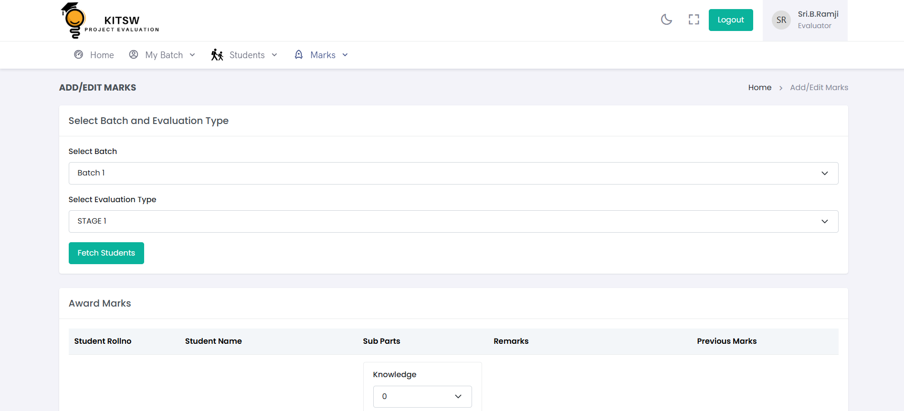
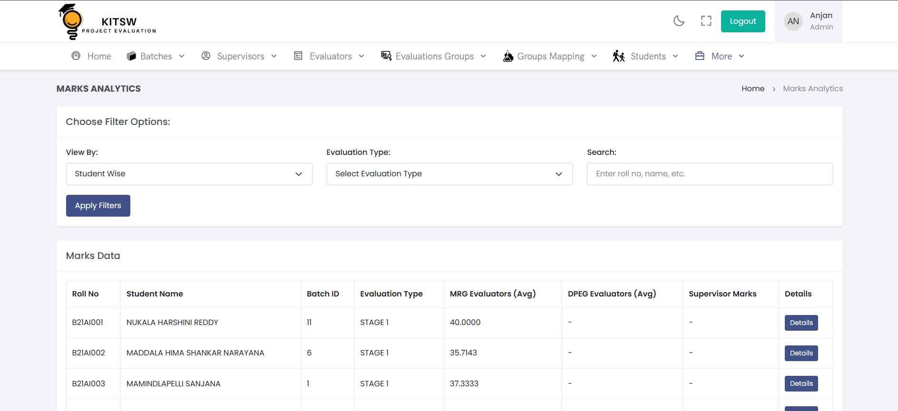
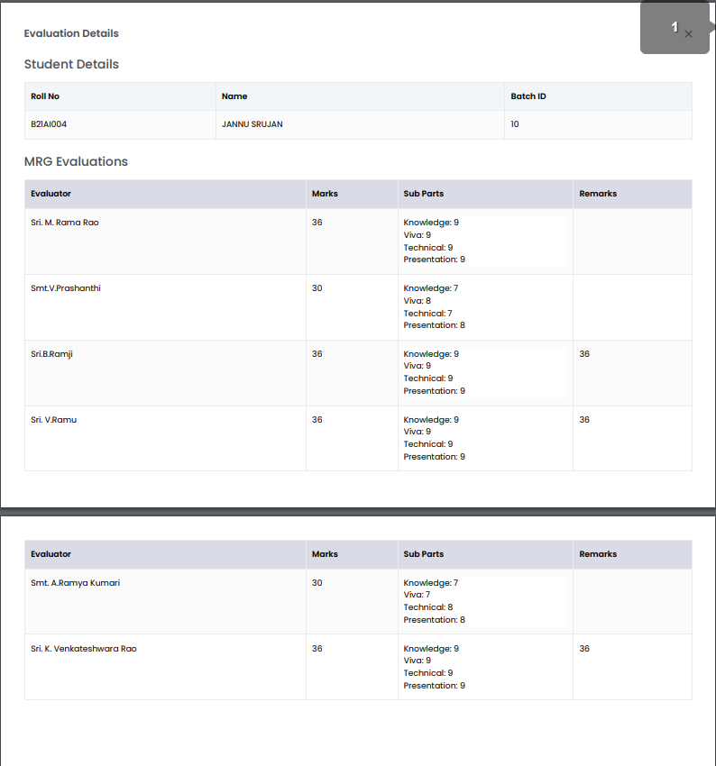
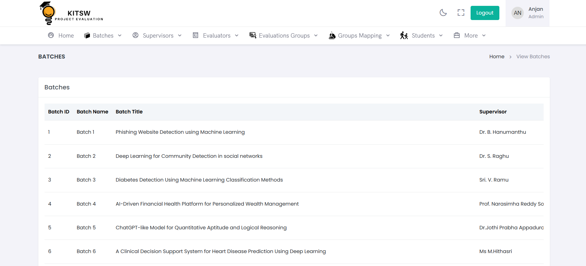

# Project Evaluation System (PES)

A comprehensive web-based system for evaluating major projects in academic institutions, featuring role-based access control and detailed analytics with printable reports.

## 📋 Overview

The Project Evaluation System is designed to streamline the evaluation process of major student projects in colleges and universities. It provides a structured approach to project assessment through multiple evaluation levels and roles.

## 🎯 Features

### Core Functionality
- **Multi-Role Based Access Control**: Four distinct user roles with specific permissions
- **Project Evaluation Workflow**: Structured evaluation process through different stages
- **Analytics Dashboard**: Comprehensive analytics with visual data representation
- **Report Generation**: Printable evaluation reports and certificates
- **Batch Management**: Organize students and projects by academic batches
- **Mark Management**: Flexible marking system with different evaluation criteria

### Role-Specific Features
- **Admin Panel**: Complete system administration and oversight
- **Student Portal**: Project submission and progress tracking
- **Supervisor Dashboard**: Project guidance and preliminary evaluation
- **Evaluation Interfaces**: Specialized tools for MRG and DPEG evaluators

## 👥 User Roles

| Role | Full Name | Description |
|------|-----------|-------------|
| **Admin** | System Administrator | Complete system control, user management, and configuration |
| **Student** | Project Student | Project submission, status tracking, and result viewing |
| **Supervisor** | Project Supervisor | Student guidance, project monitoring, and initial evaluation |
| **MRG** | Major Research Group Evaluator | Research-focused project evaluation and technical assessment |
| **DPEG** | Department Group Evaluator | Departmental-level project evaluation and final assessment |

## 🛠️ Technology Stack

- **Backend**: PHP 7.4+
- **Database**: MySQL 5.7+
- **Frontend**: Bootstrap 4/5, HTML5, CSS3, JavaScript
- **Server**: Apache/Nginx compatible
- **Additional**: jQuery, AJAX for dynamic interactions

## 📁 Project Structure

```
project-evaluation-system/
├── admin/                  # Admin panel and core management
├── student/               # Student portal and functionality
├── supervisor/            # Supervisor dashboard and tools
├── mrg/                   # Major Research Group evaluator interface
├── dpeg/                  # Department Group evaluator interface
├── assets/                # CSS, JavaScript, and other assets
├── images/                # Image assets and uploads
├── PES/                   # Core system files
├── cgi-bin/               # CGI scripts and utilities
├── .well-known/           # Web server configuration
└── *.php                  # Main application files
```

## 🚀 Installation

### Prerequisites
- Web server (Apache/Nginx)
- PHP 7.4 or higher
- MySQL 5.7 or higher
- Modern web browser

### Setup Instructions

1. **Clone/Download the project**
   ```bash
   git clone https://github.com/anjan-budige/Project-Evaluation-System-Showcase ( Private Repo )
   cd project-evaluation-system
   ```

2. **Database Setup**
   - Create a MySQL database
   - Import the database schema (if SQL file provided)
   - Update database configuration in connection files

3. **Configuration**
   - Update database credentials in configuration files
   - Set appropriate file permissions
   - Configure email settings (if applicable)

4. **Web Server Setup**
   - Point document root to project directory
   - Ensure mod_rewrite is enabled (for Apache)
   - Configure appropriate PHP settings

5. **Default Access**
   - Admin login: `admin` / `admin123` (change immediately)
   - Create initial user accounts through admin panel

## 📖 Usage Guide

### For Administrators
1. Login to admin panel
2. Add academic batches and evaluation periods
3. Create user accounts for students, supervisors, and evaluators
4. Configure evaluation criteria and marking schemes
5. Monitor system usage and generate reports

### For Students
1. Login with provided credentials
2. Submit project details and documentation
3. Track evaluation progress
4. View marks and feedback
5. Download evaluation certificates

### For Supervisors
1. Access assigned student projects
2. Provide guidance and feedback
3. Submit preliminary evaluations
4. Monitor student progress

### For Evaluators (MRG/DPEG)
1. Access assigned projects for evaluation
2. Review project submissions and documentation
3. Provide detailed evaluation and marks
4. Generate evaluation reports

## 🔧 Key Features Details

### Evaluation System
- **Multi-stage Evaluation**: Sequential evaluation by different roles
- **Flexible Marking**: Customizable marking criteria and weightages
- **Comments & Feedback**: Detailed feedback system for students
- **Evaluation History**: Complete audit trail of all evaluations

### Reporting & Analytics
- **Student Performance Reports**: Individual and batch-wise performance
- **Evaluation Statistics**: Comprehensive evaluation analytics
- **Printable Certificates**: Professional evaluation certificates
- **Export Functionality**: Data export in various formats

### User Management
- **Role-based Access**: Secure role-based permission system
- **Profile Management**: User profile and settings management
- **Batch Assignment**: Automatic student-supervisor-evaluator assignment
- **Activity Tracking**: User activity and system usage monitoring

## 📊 Database Schema

The system uses a normalized MySQL database with tables for:
- Users and authentication
- Student and project information
- Evaluation records and marks
- Batch and academic year management
- System configuration and settings

## 📸 Screenshots

### Login Page

*Secure role-based authentication system*

### Admin Dashboard

*Comprehensive admin panel with system overview*

### Student Portal

*User-friendly student interface for project submission*

### Supervisor Dashboard  

*Project monitoring and evaluation tools for supervisors*

### MRG Evaluator Interface

*Major Research Group evaluation interface*

### DPEG Evaluator Interface

*Department Group evaluation dashboard*

### Project Evaluation Form

*Detailed project evaluation and marking interface*

### Analytics Dashboard

*Comprehensive analytics with charts and reports*

### Reports & Certificates

*Professional printable reports and certificates*

### Batch Management

*Academic batch and student organization system*

---

## 🛡️ Security Features

- **Authentication**: Secure login system with session management
- **Authorization**: Role-based access control
- **Data Validation**: Input sanitization and validation
- **SQL Injection Prevention**: Prepared statements and parameterized queries
- **XSS Protection**: Output encoding and content security policies

## 📱 Browser Compatibility

- Chrome 60+
- Firefox 55+
- Safari 12+
- Edge 79+
- Internet Explorer 11+ (limited support)

## 🐛 Troubleshooting

### Common Issues
1. **Database Connection Error**: Check database credentials and server status
2. **Permission Denied**: Verify file permissions on uploads directory
3. **Session Issues**: Check PHP session configuration
4. **Email Not Working**: Verify SMTP settings and server configuration

## 📞 Support

For technical support or questions:
- Check the documentation
- Review error logs in the system
- Contact system administrator

## 📄 License

This project is developed for educational institutions. All rights reserved.

## 🔄 Version History

- **v1.0.0** - Initial release with core functionality
- **v1.1.0** - Added advanced reporting features
- **v1.2.0** - Enhanced user interface and mobile responsiveness

---

**Note**: This system is designed for academic project evaluation. Regular backups and security updates are recommended for production use.
